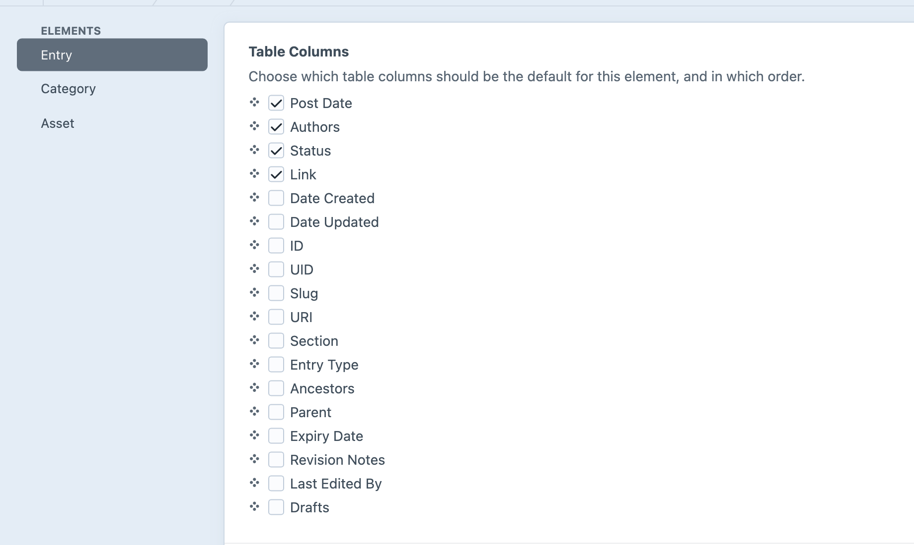

<!-- feature-intro -->
Element Index Defaults puts the useful columns in Craft’s element indexes before every user has to configure them. Set a project-wide starting view for entries, assets, categories, users, and other element types.
<!-- feature-intro-end -->

<!-- feature-section -->
## See what matters

Editors should not have to customise every content index before it becomes useful. Put the fields they scan and compare most often on screen from the start, whether that is an entry’s author and review status or an asset’s dimensions and file size.

<!-- feature-section-end -->

<!-- feature-section media-size="large" -->
## Different content, different defaults

Choose defaults per element type and source instead of imposing one table on the whole control panel. Entries, assets, categories and users can each open with the information that makes sense for the people managing them.

<!-- feature-section-end -->
